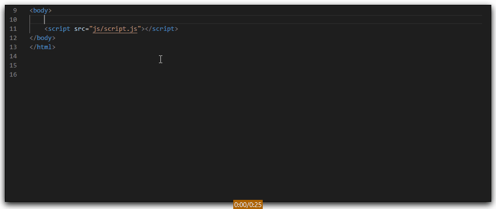
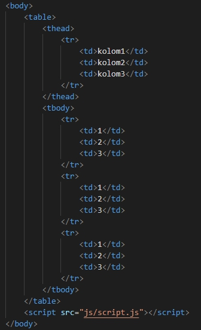

# FRONTEND-ESSENTIALS-2 - 01 - Herhaling - Taak 05

## Basic HTML 

### Uitleg

Je hebt nu geleerd hoe je HTML-elementen op hetzelfde niveau snel kan aanmaken via Emmet door een `+` te gebruiken. Daarnaast weet je hoe je elementen in andere elementen kunt aangeven met een `>`. 

Maar hoe zou je dan bijvoorbeeld de onderstaande code snel neerzetten in een HTML-bestand?

```html
    <table>
        <thead>
            <tr>
                <th></th>
                <th></th>
            </tr>
        </thead>
        <tbody>
            <tr>
                <td></td>
                <td></td>
            </tr>
            <tr>
                <td></td>
                <td></td>
            </tr>
        </tbody>
    </table>
```

Voor elke stap terug in de hiërarchie die je wilt maken, gebruik je een `^`. Dit mogen er ook meerdere achter elkaar zijn.



### Leerdoelen

1. Ik kan met Emmet een een niveau omhoog gaan in de nesting van HTML-elementen om een tabel te maken

### Opdracht

1. Maak in 1 regel Emmet code een tabel met 3 kolommen en 3 rijen. Zorg ervoor dat je ook een header-rij maakt met als inhoud van de table header (`th`) `kolom1` t/m `kolom3` en zorg ervoor dat elk regulier table-data-element  (`td`) in een tablerow (`tr`) als inhoud een cijfer bevat van `1 t/m 3`.

### Eindresultaat



### Bronnen

[Emmet.io](https://www.emmet.io/)