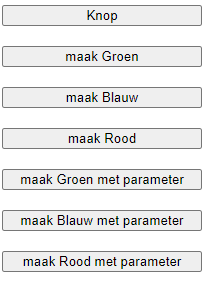

# FRONTEND-ESSENTIALS-2 - 02-Javascript - Taak05

## Herhaling

### Uitleg

Je hebt nu in voorgaande taken gezien hoe je een functie maakt met het `function` keyword, hoe je iets kan meegeven aan die functie met behulp van **parameters** en hoe je iets terug kan krijgen uit een functie met het `return` keyword. Je weet ook hoe je vanuit je code een functie kan aanroepen.

#### Het `onClick` attribuut 

Zoals je weet wordt een script van boven naar onder uitgevoerd. Tot nu toe hebben we telkens een functie gedefinieerd en deze daarna onderaan het script aangeroepen. Dit betekent dat de functie(s) worden uitgevoerd op het moment dat een bezoeker de website opent. Vaak wil je echter dat er iets gebeurt op het moment dat de gebruiker op een knop drukt of zoiets, dit doen we door een functie aan te roepen vanuit het `onClick` attribuut in een html bestand. Zie onderstaande code.

```HTML
<!-- index.html -->
<button onclick="toonAlert()">Knop</button>
```

```js
//script.js
function toonAlert(){
    alert("Je hebt op de knop gedrukt!");
}
```
Uiteraard kun je ook iets meegeven aan een functie als die wordt aangeroepen vanuit een onclick attribuut. Zie onderstaande code.
```HTML
<!-- index.html -->
<button onclick="toonAlert('Deze tekst wordt getoond in de alert')">Knop</button>
```

```js
//script.js
function toonAlert(tekst){
    alert(tekst);
}
```
:warning: LETOP: Zie het gebruik van single quotes (`''`) binnen de double quotes (`""`) wanneer je een string meegeeft aan de `toonAlert` functie in het `onclick` attribuut. 

:zap: Uiteraard staat de HTML code in het `<body>` element van `index.html`  

:rocket: Elk html element kan een `onClick` attribuut hebben. Dus ook een `div` of ander HTML element.

### Leerdoelen

1. Ik kan een functie aanroepen vanuit een HTML bestand door het `onclick` attribuut te gebruiken.
### Opdracht

1. De bovenstaande voorbeeld code staat al in `index.html` en `script.js`. Kijk maar of het werkt als je de `index.html` van deze taak opent in je browser. 
2. Er zijn 3 andere knoppen aangemaakt in `index.html` die elk een functie aanroepen in `script.js` die de achtergrond kleur van de pagina veranderd. Vul `script.js`aan zodat de `maak Blauw` en `maak Rood` knoppen ook werken.
3. Er is een functie aangemaakt in `script.js` genaamd `veranderKleur` met een parameter genaamd `kleur`. Maak 3 buttons in `index.html` die de `veranderKleur` functie aanspreken. Zorg ervoor dat de waarde die je meegeeft bepaald welke achtergrond kleur er wordt ingesteld.

### Eindresultaat



### :heart: Bronnen

* [W3S onclick Event](https://www.w3schools.com/jsref/event_onclick.asp)
* [Javascript.info - Functions](https://javascript.info/function-basics)