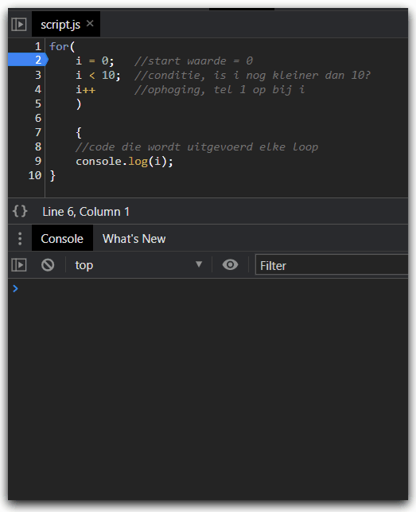

# FRONTEND-ESSENTIALS-2 - 02-Javascript - Taak011

## Loops
### Uitleg

In de vorige taken heb je leren werken met arrays, oftewel lijstjes. Je hebt geleerd hoe je elementen toevoegt aan een array en hoe je willekeurige elementen weer ophaalt. Vaak wil je echter door een lijstje heen lopen om bijvoorbeeld bepaalde elementen eruit te halen of te veranderen. Dit doe je met een loop. 

In deze taak gaan we aan de slag met `for-loops`. De syntax van een for-loop in Javascript ziet er zo uit:

```js
for(statement1; statement2; statement3){
    //codeblock (code die wordt uitgevoerd)
}
```
Je gebruikt dus het `for`-keyword om een `for-loop` te maken. Gevolgd door `()` met in dit geval 3 statements gescheiden door een `;` en dan `{}` waarin je de code schrijft die moet worden uitgevoerd in de loop.

Om te laten zien hoe dit werkt kunnen we het beste een voorbeeld pakken. Zie onderstaande code:

```js
for(i = 0; i < 10; i++){
    console.log(i);
}
```
Als je deze code runt, dan dan zal het eindresultaat zijn dat de getallen van 0 t/m 9 in de console worden gezet. Maar wat gebeurt er nu precies? De code hieronder is hetzelfde als die hierboven staat, alleen de 3 verschillende statements die je moet meegeven aan de for-loop zijn elk op een eigen regel geplaatst.

```js
for(
    i = 0;   //statement1 -> variabele i wordt aangemaakt en krijgt de waarde 0. Dit gebeurt 1 keer.
    i < 10;  //statement2 -> Dit is een conditie. Als deze conditie waar (true) is dan wordt de volgende statement uitgevoerd.
    i++      //statement3 -> Ophoging. Hier wordt de variabele i met 1 opgehoogd. Daarna wordt statement2 weer uitgevoerd. 
    )

    {
    //Deze code wordt telkens uitgevoerd zolang statement2 waar (true) is.
    console.log(i); 
}  
```
:zap: De standaard is om `i` te gebruiken als variabele in loops. Je zou deze variabele ook `teller` of `counter` kunnen noemen, want dat is het eigenlijk. Maar omdat het zo'n bekend onderdeel is van elke loop is het voor iedereen duidelijk wat deze variabele doet, dus volstaat `i`. Afhankelijk van wie je het vraagt staat de i voor _index_ of _iteratie_. In een loop noem je elke keer dat de code wordt uitgevoerd één iteratie van die loop. Dus bij een for loop waarbij `i = 0; i < 5; i++` geldt worden er 5 iteraties uitgevoerd.

Soms is een plaatje handiger. In onderstaande gif zie je hoe de Javascript code regel voor regel wordt uitgevoerd. Zoals je ziet, wordt alleen aan het begin de eerste statement uitgevoerd en daarna de andere twee tot `i` gelijk is aan 10 en de conditie van statement 2 niet meer waar (true) is. 



### Leerdoelen

1. Ik kan een for-loop maken in javascript

### Opdracht

1. Maak in `script.js` een for-loop die de getallen van 0 t/m 99 in de console zet.

### Eindresultaat

Er worden 100 waardes (0 t/m 99) in de console getoond. 
### :heart: Bronnen

* [W3S Javascript For Loop](https://www.w3schools.com/js/js_loop_for.asp)
* [W3S Javascript Arrays](https://www.w3schools.com/js/js_arrays.asp)  
* [W3S Javascript Array push() method](https://www.w3schools.com/jsref/jsref_push.asp)